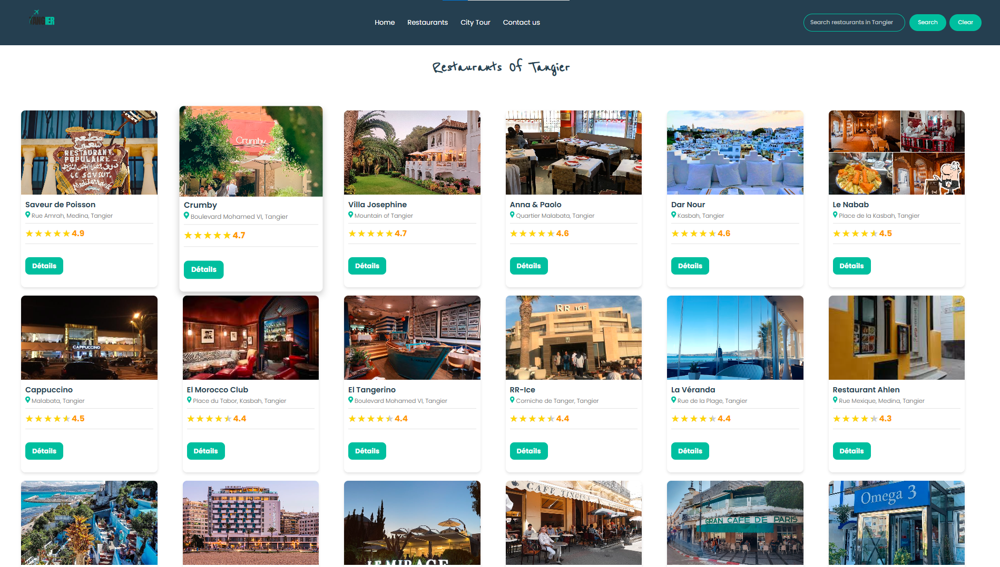
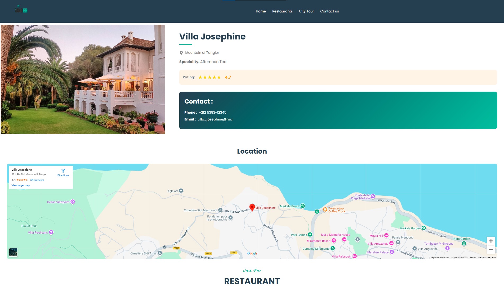

# Restaurant of Tangier


This project is a web application that provides an overview of all the restaurants in Tangier. Users can explore various restaurants, view their details, and navigate through an easy-to-use interface. The application is built using a combination of front-end and back-end technologies, ensuring a dynamic and responsive user experience.

## Features
- **Explore Restaurants**: View a comprehensive list of restaurants in Tangier.
- **Details Page**: Click on any restaurant to see detailed information.
- **Admin Panel**: Manage restaurant data through an admin interface where you can:
  - **Add a Restaurant**: Add a new restaurant with its name, location, and details.
  - **Delete a Restaurant**: Remove a restaurant from the list.
- **Search Bar**: Easily find restaurants by their name or location using the search feature.
- **Interactive UI**: A user-friendly interface with modern styling.

## Screenshots

### Restaurant's Page


### Details Page


### Admin Page


## Technologies Used
- **Frontend**:
  - HTML
  - CSS
  - JavaScript
- **Backend**:
  - Node.js
  - JSON for data storage

## Project Structure
```
RESTAURANT-OF-TANGIER
├── .vscode
├── backend
│   ├── data
│   │   └── restaurants.json
│   ├── node_modules
│   ├── package-lock.json
│   ├── package.json
│   └── server.js
├── frontend
│   ├── css
│   │   ├── admin.css
│   │   └── style.css
│   ├── img
│   │   ├── arhihou-anas-Kn6isYSQaqs-unsplash.jpg
│   │   ├── location.svg
│   │   ├── Symbol.svg
│   │   ├── tan_1-removebg-preview.png
│   │   └── tan-removebg-preview.png
│   ├── js
│   │   ├── admin.js
│   │   ├── details.js
│   │   ├── Restaurants.js
│   │   └── script.js
│   ├── admin.html
│   ├── details.html
│   ├── index.html
│   └── restaurants.html
├── .gitattributes
└── README.md
```

## Setup Instructions

1. **Clone the repository**:
   ```bash
   git clone https://github.com/abdelhaymallouli/Restaurant-of-Tangier.git
   ```

2. **Navigate to the project directory**:
   ```bash
   cd Restaurant-of-Tangier
   ```

3. **Install dependencies**:
   Navigate to the `backend` folder and run:
   ```bash
   npm install
   ```

4. **Start the server**:
   ```bash
   node server.js
   ```

5. **Open the application**:
   Open `index.html` in your browser to explore the frontend.

## Future Improvements
- Add a database for more scalable data storage.
- Implement user authentication.
- Enhance the admin panel with more features.
- Optimize for mobile devices.

## Contributing
Contributions are welcome! Feel free to fork this repository and submit a pull request with your improvements.


## Acknowledgments
- Images and icons are credited to their respective creators.
- Special thanks to the developers and designers of this project.

